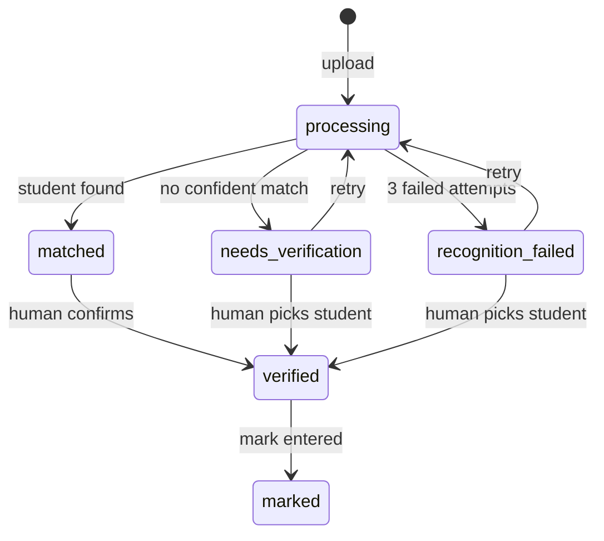

# API Reference — Architecture and Endpoint Inventory

## Revision History

| Date | Author | Change |
|---|---|---|
| 2026-09-30 | @CiViCDottir | Initial version (issue #15) |
| 2026-10-06 | PostGrade maintainers | Release integration reference: pagination, CSV, protected files, archives, authentication and operations |

## Table of Contents

1. [Introduction](#1-introduction)
2. [Architecture](#2-architecture)
3. [Conventions](#3-conventions)
4. [Authentication (`/api/auth/`)](#4-authentication-apiauth)
5. [Courses (`/api/courses/`)](#5-courses-apicourses)
6. [Students and Enrollments (`/api/students/`, `/api/enrollments/`)](#6-students-and-enrollments-apistudents-apienrollments)
7. [Assessments and Results (`/api/assessments/`, `/api/results/`)](#7-assessments-and-results-apiassessments-apiresults)
8. [Submissions and Recognition](#8-submissions-and-recognition)
9. [Result Email Delivery](#9-result-email-delivery)
10. [Data Lifecycle and Operations](#10-data-lifecycle-and-operations)
11. [Error Response Conventions](#11-error-response-conventions)
12. [Related Resources](#12-related-resources)
13. [Issues List](#13-issues-list)
14. [Release Integration Status](#14-release-integration-status)

---

## 1. Introduction

### 1.1 Purpose

This document is the entry point for understanding PostGrade's
backend API. It covers the architecture shared by every app, and
gives a full endpoint inventory — with synthetic request/response
examples — for the four apps that had never been documented at the
API level: **accounts, courses, students, and assessments**.

### 1.2 Scope

This document intentionally does **not** duplicate documentation
that already exists elsewhere in `DOCS/`. Submissions, recognition,
email delivery, and backup/restore each already have their own
detailed, dedicated document (linked in
[§12 Related Resources](#12-related-resources)); this document
covers those areas only at a high level and points to the detailed
docs for anything beyond that.

### 1.3 Requirement Traceability

Written to close issue #15 ("Update backend documentation and API
examples for current workflows"), created from the PostGrade
development review on 2026-09-14.

### 1.4 Release baseline

This reference documents the consolidated release behavior, not a claim
that every merged PR has reached `master`. The baseline inspected on
6 October 2026 is `master` at `33721de`, with the completed archive
implementation in PR #39 (`f9a3305`) and authentication/cleanup/queue work
in the stacked branches listed in [§14](#14-release-integration-status).
Integrate those implementations into `master` before merging this reference
as the final release documentation. Until then, the archive, registration,
throttle, Ruff and failed-recognition queue rules are release-target rules.

File validation/downloads (#22), transition locking (#24), pagination and
dashboard APIs (#29), deployment groundwork (#32), duplicate validation
(#31) and CSV hardening (#36) are already on the inspected master.
Bubble recognition, QR grouping and deployed staging validation remain open.

---

## 2. Architecture

Every request to this API follows the same path, regardless of
which app handles it:

```
Client (Vue frontend, or any API consumer)
  | HTTP + JSON, JWT Bearer token
  v
Django URL routing (config/urls.py)
  v
App-level URL routing (e.g. courses/urls.py)
  v
DRF View (validates permissions, orchestrates the request)
  v
Serializer (validates input, shapes output)
  v
Model / service layer (business rules, database access)
  v
PostgreSQL
  v
JSON response
```

### 2.1 App inventory

| App | Owns | Status |
|---|---|---|
| `accounts` | Users, JWT authentication | Documented in §4 |
| `courses` | Course records | Documented in §5 |
| `students` | Students, enrollments, CSV import | Documented in §6 |
| `assessments` | Assessments, results, gradebook, statistics | Documented in §7 |
| `submissions` | Uploaded scripts, OCR recognition, verification | Summarized in §8; full detail in `RECOGNITION_EVIDENCE_API.md` and `RECOGNITION_WORKER.md` |
| `dashboard` | Owner-scoped counts and assessment progress | §3 and `API_CONTRACT.md` |
| `distribution` | Result email delivery | Summarized in §9; full detail in `RESULT_EMAIL_DELIVERY.md` |

### 2.2 The ownership pattern

Almost every queryset in this codebase is filtered by ownership —
either `owner=request.user` directly, or by walking a relationship
to reach the owning user (e.g. `course__owner=request.user`). This
is the core authorization mechanism throughout the API: a lecturer
can only ever see and modify their own courses, students,
assessments, and submissions. When adding a new endpoint, preserve
this pattern.

---

## 3. Conventions

- **Base path:** all endpoints below are relative to `/api/`.
- **Format:** all requests and responses use JSON, except file
  uploads (`multipart/form-data`) and file downloads.
- **Authentication:** API endpoints except `register`, `login` and
  `refresh` requires a JWT access token (see §4). `refresh` takes the
  refresh token in the request body, so it works without an access
  token.
- **Pagination:** list endpoints return `{count, next, previous, results}`.
  `page` defaults to 1; `page_size` defaults to 25 and is capped at 100.
  Empty first pages return `200` with `results: []`; out-of-range pages
  return `404`. Read all required pages rather than treating page 1 as a
  complete class list. Filters/search are validated and owner-scoped; see
  [API_CONTRACT.md](API_CONTRACT.md) for each list's filters and ordering.
- **Dates and values:** dates use `YYYY-MM-DD`, timestamps carry timezone
  information, and serializer decimal fields such as marks/maxima/weights
  are strings. Calculated percentages in custom JSON responses are numbers;
  clients should format them for display. Student numbers are strings.
- **Archive scope:** after #39 is integrated, normal workflows exclude
  archived courses/assessments. Detail/action routes return `404`, while
  filters and foreign-key inputs naming archived records return `400`.
  See [ARCHIVING.md](ARCHIVING.md).

- **Examples use synthetic data only.** No email address, name, or
  student number in this document corresponds to a real person.

---

### 3.1 Dashboard and operational endpoints

| Method | Endpoint | Authentication and result |
|---|---|---|
| `GET` | `/api/dashboard/stats/` | JWT; current-year course count, pending review and counts by status |
| `GET` | `/api/dashboard/assessments/` | JWT; paginated assessment progress with course/search filters |
| `GET` | `/health/live/` | No JWT; process liveness, no database query |
| `GET` | `/health/ready/` | No JWT; database readiness, 200 or 503 |

The release queue/pending count includes `matched`, `needs_verification`
and `recognition_failed` once #41's code reaches master. #39 removes
archived parents from these counts. Health paths are outside `/api/` and
are handled by middleware; other paths still apply normal host checks.

## 4. Authentication (`/api/auth/`)

| Method | Endpoint | Auth required | Purpose |
|---|---|---|---|
| `POST` | `/api/auth/register/` | No | Create a user when registration is enabled; otherwise 403 |
| `POST` | `/api/auth/login/` | No | Obtain JWT access + refresh tokens |
| `POST` | `/api/auth/refresh/` | No (refresh token) | Obtain a new access token |
| `GET` | `/api/auth/me/` | Yes | Return the authenticated user |

PostGrade uses a custom user model with **email as the login field**
(no username). Every user has a `role`: `ADMIN`, `LECTURER`, or
`MARKER` — but as of this writing, API authorization is based on
**ownership**, not role; the role field is not yet used to restrict
access to specific endpoints.

### 4.1 Register

Release policy from #33: `ALLOW_REGISTRATION` defaults to `DEBUG`, so local
development is open and production is closed unless explicitly enabled.
A closed signup returns `403`; administrators create lecturer accounts in
Django admin. Login defaults to 10 attempts/minute and signup to 5/hour per
client, then `429` with `Retry-After`. Counts use the shared database cache
created by migration. Configure `NUM_PROXIES` for the actual trusted proxy
topology; do not blindly trust forwarded client headers. These controls
must first be integrated from the stacked auth branch (see §14).

Roles remain stored labels with authenticated owner access, not delegated
course authorization. Password reset, token revocation and browser token
storage follow-ups are in [PERMISSIONS.md](PERMISSIONS.md).

**Request**
```http
POST /api/auth/register/
Content-Type: application/json

{
  "email": "lecturer1@example.edu",
  "first_name": "Ada",
  "last_name": "Lovelace",
  "password": "a-strong-password-123"
}
```

**Response — `201 Created`**
```json
{
  "id": 4,
  "email": "lecturer1@example.edu",
  "first_name": "Ada",
  "last_name": "Lovelace"
}
```

### 4.2 Login

**Request**
```http
POST /api/auth/login/
Content-Type: application/json

{
  "email": "lecturer1@example.edu",
  "password": "a-strong-password-123"
}
```

**Response — `200 OK`**
```json
{
  "refresh": "eyJhbGciOi...",
  "access": "eyJhbGciOi..."
}
```

Every subsequent request must include the access token:
```http
Authorization: Bearer eyJhbGciOi...
```

### 4.3 Current user

**Request**
```http
GET /api/auth/me/
Authorization: Bearer eyJhbGciOi...
```

**Response — `200 OK`**
```json
{
  "id": 4,
  "email": "lecturer1@example.edu",
  "first_name": "Ada",
  "last_name": "Lovelace",
  "role": "LECTURER"
}
```

---

## 5. Courses (`/api/courses/`)

A course belongs to exactly one lecturer (`owner`). Uniqueness is
enforced on `(owner, code, year, semester)` — the same lecturer
cannot create two courses with the same code in the same
year/semester.

| Method | Endpoint | Purpose |
|---|---|---|
| `GET` | `/api/courses/` | List the authenticated user's courses |
| `POST` | `/api/courses/` | Create a course (owner is set automatically) |
| `GET` | `/api/courses/<id>/` | Retrieve one course |
| `PUT`/`PATCH` | `/api/courses/<id>/` | Update a course |
| `DELETE` | `/api/courses/<id>/` | Archive a course, retaining its data/files; 204 (#39 release policy) |
| `GET` | `/api/courses/<course_id>/students/` | List students enrolled in this course |
| `POST` | `/api/courses/<course_id>/import-students/` | Bulk-import students from a CSV file |

### 5.1 Create a course

**Request**
```http
POST /api/courses/
Authorization: Bearer <token>
Content-Type: application/json

{
  "code": "CSC201",
  "name": "Data Structures and Algorithms",
  "year": 2026,
  "semester": 2
}
```

**Response — `201 Created`**
```json
{
  "id": 12,
  "code": "CSC201",
  "name": "Data Structures and Algorithms",
  "year": 2026,
  "semester": 2,
  "created_at": "2026-09-30T09:00:00Z",
  "updated_at": "2026-09-30T09:00:00Z"
}
```

**Duplicate validation — `400 Bad Request`**

Creating or updating a course into the same owner/code/year/semester key
returns a field error under `code`. Student-number duplicates for the same
owner likewise return `400`; editing a record without changing its key is
allowed. Database uniqueness remains the final integrity constraint.

### 5.2 CSV student import

Send the class-list file as multipart field `file`. Required headers are
`student_number,first_name,last_name,email` in any order. UTF-8 and UTF-8
BOM are supported; row values are trimmed and student-number leading zeros
are preserved. Limits are 2 MB and 5,000 data rows. Blank rows are skipped;
missing/extra fields, duplicate numbers and validation errors are reported.
The importer reads CSV text; a filename extension is not a content check.

```csv
student_number,first_name,last_name,email
0020261001,Naledi,Dlamini,naledi.dlamini@example.edu
20261002,Thabo,Mokoena,thabo.mokoena@example.edu
```

```http
POST /api/courses/12/import-students/
Authorization: Bearer <token>
Content-Type: multipart/form-data

file: roster.csv
dry_run: false
update_existing: false
```

The entire file is validated before saving. Any invalid row returns `400`
and no planned updates, creates or enrollments are applied. Actual writes
commit together in one transaction. Reimports reuse owner-scoped students
and enrollments. An existing student's name/email is preserved by default;
differences appear in `mismatches`. `update_existing=true` explicitly opts
into updates. `dry_run=true` returns planned counts/mismatches without
saving, including when combined with `update_existing=true`.

**Success — `200 OK`**
```json
{
  "message": "Students imported successfully.",
  "dry_run": false,
  "summary": {
    "total": 2, "failed": 0, "rows_processed": 2,
    "created": 2, "updated": 0, "matched_unchanged": 0, "enrolled": 2
  },
  "mismatches": []
}
```

**Row validation — `400 Bad Request`**
```json
{
  "message": "Import failed. Nothing was saved.",
  "errors": [{
    "row": 2,
    "student_number": "20261002",
    "errors": {"email": ["Enter a valid email address."]},
    "message": "email: Enter a valid email address."
  }],
  "summary": {
    "total": 1, "failed": 1, "rows_processed": 1,
    "created": 0, "updated": 0, "matched_unchanged": 0, "enrolled": 0
  },
  "mismatches": []
}
```

Counts describe the validated plan, including in a dry run or a rejected
mixed batch; the explicit response message says whether anything was saved.
`row` numbers start at 2 after the header. File-level errors use
`{"file": "Missing required columns: email"}` (also for unreadable encoding
or exceeded size limits). A mismatch contains `row`, `student_number` and
`differences`, mapping changed fields to `existing`/`incoming` values.
An archived course returns `404` once #39 is integrated, including when
archiving occurs between validation and applying a plan.

---

## 6. Students and Enrollments (`/api/students/`, `/api/enrollments/`)

A `Student` belongs to one lecturer (`owner`). An `Enrollment` links
a `Student` to a `Course` — both must belong to the same lecturer.

| Method | Endpoint | Purpose |
|---|---|---|
| `GET` | `/api/students/` | List the authenticated user's students |
| `POST` | `/api/students/` | Create a student manually |
| `GET` | `/api/students/<id>/` | Retrieve one student |
| `PUT`/`PATCH` | `/api/students/<id>/` | Update a student |
| `DELETE` | `/api/students/<id>/` | Delete a student |
| `POST` | `/api/students/<id>/email/` | Send a free-text email to this student |
| `GET` | `/api/enrollments/` | List the authenticated user's enrollments |
| `POST` | `/api/enrollments/` | Enroll a student in a course |

### 6.1 Create a student

**Request**
```http
POST /api/students/
Authorization: Bearer <token>
Content-Type: application/json

{
  "student_number": "20261004",
  "first_name": "Farai",
  "last_name": "Chiweshe",
  "email": "farai.chiweshe@example.edu"
}
```

**Response — `201 Created`**
```json
{
  "id": 45,
  "student_number": "20261004",
  "first_name": "Farai",
  "last_name": "Chiweshe",
  "email": "farai.chiweshe@example.edu",
  "created_at": "2026-09-30T09:05:00Z",
  "updated_at": "2026-09-30T09:05:00Z"
}
```

### 6.2 Enroll a student

**Request**
```http
POST /api/enrollments/
Authorization: Bearer <token>
Content-Type: application/json

{
  "course": 12,
  "student": 45
}
```

**Response — `201 Created`**
```json
{
  "id": 88,
  "course": 12,
  "student": 45,
  "created_at": "2026-09-30T09:06:00Z"
}
```

**Error — `400 Bad Request`** (enrolling a student that belongs to
a different lecturer)
```json
{
  "student": ["You cannot enroll this student."]
}
```

### 6.3 Email a student

Sends a free-text email directly (separate from the automated
result-delivery emails covered in §9).

**Request**
```http
POST /api/students/45/email/
Authorization: Bearer <token>
Content-Type: application/json

{
  "subject": "Missing submission for Test 2",
  "message": "Hi Farai, we don't have a submission from you for Test 2. Please see me during office hours."
}
```

**Response — `200 OK`**
```json
{
  "detail": "Email sent."
}
```

---

## 7. Assessments and Results (`/api/assessments/`, `/api/results/`)

An `Assessment` belongs to one `Course` and defines `max_mark` and
`weight` (used in the weighted course-grade calculation). A `Result`
links one `Enrollment` to one `Assessment` and stores a `mark`,
which cannot exceed the assessment's `max_mark`.

| Method | Endpoint | Purpose |
|---|---|---|
| `GET`/`POST` | `/api/courses/<course_id>/assessments/` | List/create assessments for a course |
| `GET`/`PUT`/`PATCH`/`DELETE` | `/api/assessments/<id>/` | Manage one assessment; DELETE archives with 204 (#39 release policy) |
| `GET`/`POST` | `/api/assessments/<assessment_id>/results/` | List/create results for an assessment |
| `GET`/`PUT`/`PATCH`/`DELETE` | `/api/results/<id>/` | Manage one result |
| `GET` | `/api/courses/<course_id>/gradebook/` | Full gradebook for a course |
| `GET` | `/api/assessments/<id>/statistics/` | Aggregate statistics for one assessment |

### 7.1 Create an assessment

**Request**
```http
POST /api/courses/12/assessments/
Authorization: Bearer <token>
Content-Type: application/json

{
  "name": "Test 2",
  "max_mark": "50.00",
  "weight": "15.00",
  "date": "2026-10-15"
}
```

**Response — `201 Created`**
```json
{
  "id": 30,
  "course": 12,
  "name": "Test 2",
  "max_mark": "50.00",
  "weight": "15.00",
  "date": "2026-10-15",
  "created_at": "2026-09-30T09:10:00Z",
  "updated_at": "2026-09-30T09:10:00Z"
}
```

### 7.2 Record a result

**Request**
```http
POST /api/assessments/30/results/
Authorization: Bearer <token>
Content-Type: application/json

{
  "enrollment": 88,
  "mark": "42.00"
}
```

**Response — `201 Created`**
```json
{
  "id": 61,
  "assessment": 30,
  "enrollment": 88,
  "student_number": "20261004",
  "student_name": "Farai Chiweshe",
  "mark": "42.00",
  "percentage": 84.0,
  "created_at": "2026-09-30T09:12:00Z",
  "updated_at": "2026-09-30T09:12:00Z"
}
```

**Error — `400 Bad Request`** (mark exceeds max_mark)
```json
{
  "mark": ["Mark cannot exceed the assessment's maximum mark."]
}
```

**Note:** editing a `Result` that has any existing result-email record
schedules an email for the new mark version
(see §9) — a `Result` also carries a `version` number, incremented
on every mark change, which the email system uses to avoid sending
duplicate or stale notifications.

### 7.3 Gradebook

**Request**
```http
GET /api/courses/12/gradebook/
Authorization: Bearer <token>
```

**Response — `200 OK`**
```json
{
  "course": 12,
  "students": [
    {
      "enrollment": 88,
      "student": 45,
      "student_number": "20261004",
      "first_name": "Farai",
      "last_name": "Chiweshe",
      "assessments": [
        {
          "assessment": 30,
          "name": "Test 2",
          "mark": 42.0,
          "max_mark": 50.0,
          "percentage": 84.0,
          "weight": 15.0
        }
      ],
      "course_percentage": 84.0
    }
  ]
}
```

`mark` and `percentage` are `null` for any assessment the student
hasn't been marked for yet. `course_percentage` is a weighted
average across only the assessments that **do** have a recorded
result — an ungraded assessment does not count against a student.

Gradebook values are calculated with Python `Decimal`, but DRF's JSON
renderer emits those custom response values as JSON numbers. The direct
result serializer emits `mark` as a decimal string and a rounded numeric
`percentage`. Do not infer fixed display precision from JSON numeric values;
format percentages in the client. After #39, archived assessments are
excluded from both the gradebook and weighted course percentage.

### 7.4 Assessment statistics

**Request**
```http
GET /api/assessments/30/statistics/
Authorization: Bearer <token>
```

**Response — `200 OK`**
```json
{
  "assessment": 30,
  "name": "Test 2",
  "graded_count": 1,
  "average_percentage": 84.0,
  "minimum_percentage": 84.0,
  "maximum_percentage": 84.0
}
```

---

## 8. Submissions and Recognition

The submissions app is where uploaded scripts go through automated
student-number recognition, human verification, and marking. It has
grown substantially and is **documented separately and in depth**:

- **`DOCS/RECOGNITION_EVIDENCE_API.md`** — every submission
  endpoint, the full recognition-outcome catalogue, quality-check
  thresholds, confidence types, and error responses. Includes an
  explicit, honest note that **bubble-sheet recognition is a
  planned format, not yet implemented** — only OCR-based recognition
  currently runs.
- **`DOCS/RECOGNITION_WORKER.md`** — how the background recognition
  worker works, local setup, retry/crash-recovery behaviour, and
  troubleshooting.

### 8.1 Submission status lifecycle (summary)



A submission enters `processing` the moment it's uploaded, and a
background worker (see `RECOGNITION_WORKER.md`) attempts automatic
recognition. Each job gets up to three attempts (the default
`max_attempts`); if all fail, the submission becomes
`recognition_failed`. If a student is found it becomes `matched`,
otherwise `needs_verification`. Recognition suggestions require human
confirmation: `matched`, `needs_verification` and `recognition_failed`
submissions appear in the release
verification queue (`GET /api/submissions/verification-queue/`) for
a human to confirm or resolve.

- **Retry** (`POST /api/submissions/<id>/retry-recognition/`) puts a
  `recognition_failed` or `needs_verification` submission back into
  `processing`. Retrying one that is already `processing` does
  nothing; any other status is rejected.
- **Verify** (`POST /api/submissions/<id>/verify/`) accepts legal transitions
  from `processing`, `matched`, `needs_verification`, `recognition_failed`
  or `verified`; it rejects `uploaded` and `marked`. The chosen enrollment
  must belong to the submission's course. Validation uses the locked row.
  The generic PATCH/version and correction gaps remain tracked in #6.
- **Mark** (`POST /api/submissions/<id>/mark/`) requires the status
  `verified`; otherwise it returns 400.

### 8.2 Protected files and replacement

Uploaded PDF/JPG/JPEG/PNG content is opened and validated, not trusted from
its name alone. Limits: 15 MB, 20 PDF pages, and decoded dimensions of
6,000 pixels. Recognition reads PDF page 1; multipage QR grouping is not
implemented. Invalid content/size/dimensions return `400` field errors.

| Method | Endpoint | Purpose |
|---|---|---|
| `GET` | `/api/submissions/<id>/file/` | Authenticated owner download of the original |
| `GET` | `/api/submissions/<id>/recognition-image/` | Authenticated latest number-area crop |
| `DELETE` | `/api/submissions/<id>/` | Delete the submission and clean stored original/crops after commit |
| `PATCH` | `/api/submissions/<id>/` | Replace an unmarked file using multipart input; restart recognition |

`file` is write-only input. Responses expose `download_url`, not a public
`/media/` URL; preview clients must fetch with their token, then display a
blob. Marked files cannot be replaced. Replacement cancels prior recognition,
clears the enrollment and deletes the old file only after the new database
transaction commits. Deleting a marked submission retains its separate
Result, but the current submission-bound audit relationship is still
`CASCADE`; changing that relationship is a separate #10 decision.

Generic updates require `version`; the replacement path still has the
version/audit gaps recorded in #6. Storage cleanup is implemented, but
there is no timed retention purge. #39 blocks all these paths for archived
parents without deleting their files. See the detailed recognition and
[archive documentation](ARCHIVING.md).

---

## 9. Result Email Delivery

Saving a mark and its result-email record commit together. A mail worker
delivers later; mark-save success is separate from email delivery. The
default release policy is `automatic`; `approval` creates
`awaiting_approval` records. Email statuses are `awaiting_approval`,
`queued`, `sending`, `sent`, `failed` and `superseded`.

Read `/api/assessments/<id>/result-emails/` as a paginated list. Match email
records to Result IDs and use `is_current` for the current mark version.
Preview the server's `recipient`, `subject` and `body`. Approval and retry
use **email IDs**, not Result IDs; `delivery_unknown` retry requires
`confirm_duplicate: true` because delivery may already have occurred.
Marking returns `email_delivery` alongside the Result. See
[RESULT_EMAIL_DELIVERY.md](RESULT_EMAIL_DELIVERY.md) for all endpoints.

These emails currently contain mark/percentage text; they do not attach
the marked script or grant student download access. Original-script return
still needs an agreed delivery mechanism. Once #39 is integrated, archive
suppresses unsent email work while retaining delivery history; an SMTP
send already in progress cannot be recalled.

---

## 10. Data Lifecycle and Operations

- **Archive policy (#39 release prerequisite):** course/assessment DELETE
  returns `204`, hides archived workflows and retains records and files.
  Later reads/actions return `404`; filters/foreign-key inputs return `400`.
  Queued recognition and unsent emails are cancelled/superseded. Global
  student contacts remain available for other active courses. There is no
  restore endpoint; archived course keys still count toward uniqueness.
  See [ARCHIVING.md](ARCHIVING.md).
- **Other deletes:** student and Result DELETE are still destructive, with
  the model's existing cascade rules. Course/assessment archiving does not
  change those relationships or make every database deletion safe.
- **Retention:** no automatic age-based purge. Submission deletion cleans
  originals and crops after commit; replacement cleans the old original
  after the new transaction commits. Archiving never purges files.
- **Production:** [DEPLOYMENT.md](DEPLOYMENT.md) covers environment secrets,
  HTTPS/proxy/CORS, database/private media, containers, workers, logs,
  rollback and staging checklist. Configuration/container groundwork is
  implemented; a host and successful deployed staging demonstration still
  need evidence. `GET /health/live/` and `GET /health/ready/` are outside
  `/api/`; readiness returns `503` when the database is unavailable.
- **Recovery:** [BACKUP_RESTORE.md](BACKUP_RESTORE.md) documents backup and
  restore; representative existing-data migration/performance checks
  remain distinct from the completed local recovery demonstration.
- **Verification commands:**
  ```bash
  python manage.py check
  python manage.py makemigrations --check --dry-run
  python manage.py test
  ```
  Fast CI runs audit/email/submission/verification tests; integration runs
  the full suite including OCR. #37 adds enforced Ruff lint after its code
  reaches master; formatting remains non-blocking until the separate
  formatting pass. See [CI.md](CI.md).

---

## 11. Error Response Conventions

Across all apps in this document (accounts, courses, students,
assessments), validation errors follow Django REST Framework's
default shape: a JSON object whose keys are the field names that
failed, each mapping to a list of human-readable messages.
Non-field errors may appear under `"non_field_errors"`. CSV errors use the
separate summary/row envelope in §5.2; file-level CSV errors use a string
under `file`. Action errors usually use `detail`.

```json
{
  "field_name": ["What was wrong with this field."],
  "non_field_errors": ["A problem that isn't tied to one field."]
}
```

`submissions` and `distribution` follow a similar shape but with
some endpoint-specific extensions — see their dedicated docs for
the full error catalogue.

Common HTTP status codes used throughout:

| Status | Meaning in this API |
|---|---|
| `200 OK` | Successful GET, or a successful action returning data |
| `201 Created` | Successful POST that created something |
| `400 Bad Request` | Validation failed |
| `401 Unauthorized` | Missing or invalid JWT token |
| `404 Not Found` | Missing/other-owner object, out-of-range page, or archived workflow after #39 |
| `403 Forbidden` | Registration disabled by release policy |
| `429 Too Many Requests` | Auth throttle exceeded; respect `Retry-After` |
| `204 No Content` | Successful delete/archive; body is empty |
| `202 Accepted` | Retry/approval queued asynchronous work |
| `503 Service Unavailable` | Database readiness failed |

---

## 12. Related Resources

| Document | Covers |
|---|---|
| `DOCS/POSTGRESQL_SETUP.md` | Local database setup |
| `DOCS/RECOGNITION_EVIDENCE_API.md` | Full submission/recognition API, quality checks, bubble format (planned) |
| `DOCS/RECOGNITION_WORKER.md` | Background recognition worker setup and troubleshooting |
| `DOCS/RESULT_EMAIL_DELIVERY.md` | Async result email delivery |
| [`DEPLOYMENT.md`](DEPLOYMENT.md) | Production setup, workers, staging and rollback |
| [`PERMISSIONS.md`](PERMISSIONS.md) | Release permission matrix, registration/throttling and F1–F4 |
| [`API_CONTRACT.md`](API_CONTRACT.md) | Pagination, filtering, dashboard counts and types |
| [`ARCHIVING.md`](ARCHIVING.md) | Archive enforcement, preservation and worker limits |
| `DOCS/BACKUP_RESTORE.md` | Database backup and recovery |
| `DOCS/CI.md`, `DOCS/DB_REVIEW.md` | CI pipeline and database review notes |
| [PostGradeVue repository](https://github.com/Devon-du-Toit/PostGradeVue) | The Vue.js frontend that consumes this API |
| README's [Development Roadmap](../README.md#development-roadmap) | Where the project is headed |

---

## 13. Issues List

| Issue | Remaining behavior or decision |
|---|---|
| #1 | Bubble registration markers, decoding and agreed held-out recognition metrics |
| #6 | Generic PATCH/replacement concurrency, marked identity correction, consistent versions/audits and Vue coordination |
| #8 | Role/delegated access, password recovery, server logout/revocation and browser token storage (F1–F4) |
| #9/#10 | Restore/course-key reuse, enrollment lifecycle and model-level deletion protection; representative-data checks |
| #12 | Service extraction and a separate enforced formatting pass |
| #14 | Deployed host/HTTPS/CORS/private media/workers and staging demonstration |
| #26/#27 | QR page grouping and optional assessment ZIP export |
| #42 | CSV bulk lookup/create query optimization |

Protected originals and cleanup are implemented by #22; they are not open
file-download gaps. Original-script delivery to students remains separate
from the implemented result-text email outbox.

## 14. Release Integration Status

Checked 6 October 2026. A PR marked merged can have a non-master base.

| Behavior | Inspected implementation | Prerequisite before these docs represent master |
|---|---|---|
| CSV/pagination/files/transition-lock/deployment foundation | `master` `33721de` | Already present |
| Archive enforcement and retained files | PR #39 head `f9a3305` | Merge #39 into master |
| Registration/throttling | #33 merged into `issue-14-deployment` | Integrate auth commits into master |
| Ruff cleanup/lint | #37 merged into `issue-8-auth-hardening` | Integrate cleanup commits into master |
| Failed recognitions in queue/dashboard | #41 merged into `issue-12-safe-cleanup` | Integrate queue commits into master |

The top `issue-12-safe-cleanup` branch (`bc72474` at inspection) contains
the stacked auth/cleanup/queue work. Integrate it with the repaired current
master and #39, resolving overlaps and rerunning CI; do not assume merging
into a parent branch releases the code. PR #40 changes documentation only.
